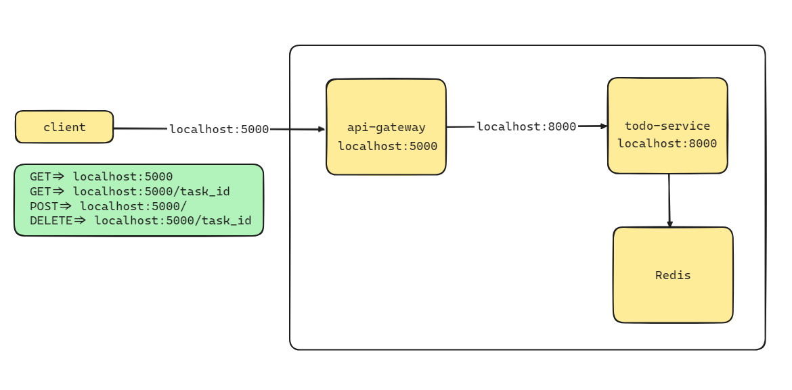

# To-Do App



## Project Structure

```
todo-app/
│
├── api-gateway/
│   ├── node_modules/
│   ├── .env
│   ├── package.json
│   ├── index.js
│   └── routes.js
│
├── todo-service/
│   ├── node_modules/
│   ├── .env
│   ├── package.json
│   ├── index.js
│   └── todoController.js
│
└── docker-compose.yml
```

## API Gateway

### `api-gateway/.env`

```plaintext
PORT=5000
TODO_SERVICE_URL=http://localhost:8000
```

### `api-gateway/package.json`

```json
{
  "name": "api-gateway",
  "version": "1.0.0",
  "main": "index.js",
  "scripts": {
    "start": "node index.js"
  },
  "dependencies": {
    "axios": "^0.27.2",
    "dotenv": "^16.0.1",
    "express": "^4.18.1"
  }
}
```

### `api-gateway/index.js`

```javascript
const express = require('express');
const dotenv = require('dotenv');
const routes = require('./routes');

dotenv.config();

const app = express();
const port = process.env.PORT || 5000;

app.use(express.json());
app.use('/', routes);

app.listen(port, () => {
  console.log(`API Gateway listening at http://localhost:${port}`);
});
```

### `api-gateway/routes.js`

```javascript
const express = require('express');
const axios = require('axios');
const router = express.Router();
const TODO_SERVICE_URL = process.env.TODO_SERVICE_URL;

// Get all tasks
router.get('/', async (req, res) => {
  try {
    const response = await axios.get(`${TODO_SERVICE_URL}/tasks`);
    res.json(response.data);
  } catch (error) {
    res.status(500).send(error.message);
  }
});

// Get a specific task by ID
router.get('/:id', async (req, res) => {
  try {
    const response = await axios.get(`${TODO_SERVICE_URL}/tasks/${req.params.id}`);
    res.json(response.data);
  } catch (error) {
    res.status(500).send(error.message);
  }
});

// Add a new task
router.post('/', async (req, res) => {
  try {
    const response = await axios.post(`${TODO_SERVICE_URL}/tasks`, req.body);
    res.json(response.data);
  } catch (error) {
    res.status(500).send(error.message);
  }
});

// Delete a task by ID
router.delete('/:id', async (req, res) => {
  try {
    const response = await axios.delete(`${TODO_SERVICE_URL}/tasks/${req.params.id}`);
    res.json(response.data);
  } catch (error) {
    res.status(500).send(error.message);
  }
});

module.exports = router;
```

## ToDo Service

### `todo-service/.env`

```plaintext
PORT=8000
REDIS_URL=redis://localhost:6379
```

### `todo-service/package.json`

```json
{
  "name": "todo-service",
  "version": "1.0.0",
  "description": "",
  "main": "index.js",
  "scripts": {
    "test": "echo \"Error: no test specified\" && exit 1"
  },
  "keywords": [],
  "author": "",
  "license": "ISC",
  "dependencies": {
    "dotenv": "^16.4.5",
    "express": "^4.19.2",
    "redis": "^4.6.15",
    "uuid": "^10.0.0"
  }
}

```

### `todo-service/index.js`

```javascript
const express = require('express');
const dotenv = require('dotenv');
const todoController = require('./todoController');

dotenv.config();

const app = express();
const port = process.env.PORT || 8000;

app.use(express.json());

app.get('/tasks', todoController.getTasks);
app.get('/tasks/:id', todoController.getTaskById);
app.post('/tasks', todoController.addTask);
app.delete('/tasks/:id', todoController.deleteTask);

app.listen(port, () => {
  console.log(`ToDo service listening at http://localhost:${port}`);
});
```

### `todo-service/todoController.js`

```javascript
const redis = require('redis');
const { v4: uuidv4 } = require('uuid'); // Import UUID library
const client = redis.createClient({
  url: process.env.REDIS_URL
});

client.connect();

exports.getTasks = async (req, res) => {
  try {
    const tasks = await client.hGetAll('tasks'); // Use hGetAll to get all tasks with their IDs
    const tasksArray = Object.keys(tasks).map(id => ({
      id,
      task: tasks[id]
    }));
    res.json(tasksArray);
  } catch (error) {
    res.status(500).send(error.message);
  }
};

exports.getTaskById = async (req, res) => {
  try {
    const taskId = req.params.id;
    const task = await client.hGet('tasks', taskId); // Get task by ID
    if (task) {
      res.json({ id: taskId, task });
    } else {
      res.status(404).send('Task not found');
    }
  } catch (error) {
    res.status(500).send(error.message);
  }
};

exports.addTask = async (req, res) => {
  try {
    const task = req.body.task;
    const taskId = uuidv4(); // Generate a unique ID for the task
    await client.hSet('tasks', taskId, task); // Store task in a hash with the task ID
    res.send({ id: taskId, task });
  } catch (error) {
    res.status(500).send(error.message);
  }
};

exports.deleteTask = async (req, res) => {
  try {
    const taskId = req.params.id;
    await client.hDel('tasks', taskId); // Delete the task by ID
    res.send('Task deleted');
  } catch (error) {
    res.status(500).send(error.message);
  }
};
```

### Docker Compose

### `docker-compose.yml`

```yaml
version: '3.8'

services:
  redis:
    image: 'redis/redis-stack:latest'
    ports:
      - '6379:6379'
      - '8001:8001'
  
  api-gateway:
    build: ./api-gateway
    ports:
      - '5000:5000'
    environment:
      - TODO_SERVICE_URL=http://todo-service:8000
    depends_on:
      - todo-service

  todo-service:
    build: ./todo-service
    ports:
      - '8000:8000'
    environment:
      - REDIS_URL=redis://redis:6379
    depends_on:
      - redis

```

## Running the Application

1. Navigate to the root directory of your project.
2. Run `docker-compose up --build`.

This setup will create the API gateway and ToDo services, and use Redis as the database. The client can make requests to the API gateway, which will forward them to the ToDo service, and the tasks will be stored in Redis.