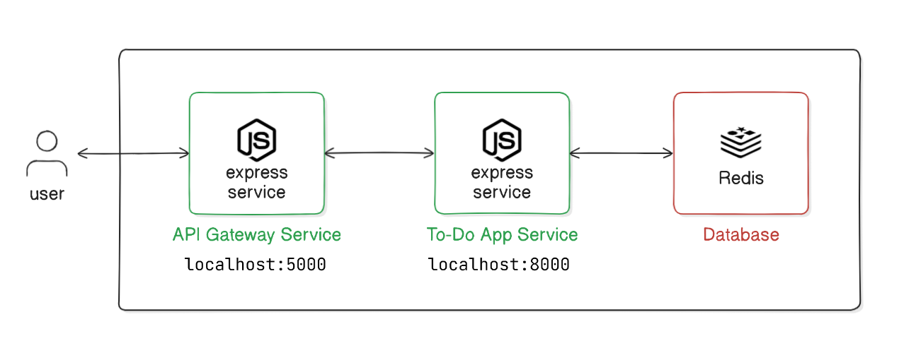

# To-Do App



This To-Do App project demonstrates a microservices architecture using Node.js, Express, and Redis. It comprises two main services: an API Gateway and a ToDo Service. The API Gateway handles client requests and forwards them to the ToDo Service, which manages task data stored in a Redis database. Docker Compose is used to manage the deployment and orchestration of these services.

## Project Structure

```
todo-app/
│
├── api-gateway/
│   ├── node_modules/
│   ├── .env
│   ├── package.json
│   ├── index.js
│   └── routes.js
│
├── todo-service/
│   ├── node_modules/
│   ├── .env
│   ├── package.json
│   ├── index.js
│   └── todoController.js
│
└── docker-compose.yml
```

### Directory Breakdown

- **api-gateway/**: Contains the API Gateway code, handling client requests and routing them to the ToDo Service.
- **todo-service/**: Contains the ToDo Service code, which interacts with Redis to manage tasks.
- **docker-compose.yml**: Defines the Docker services for the API Gateway, ToDo Service, and Redis.

## API Gateway

### `api-gateway/.env`

This file contains environment variables for the API Gateway:

```plaintext
PORT=5000
TODO_SERVICE_URL=http://localhost:8000
```

- **PORT**: The port on which the API Gateway runs.
- **TODO_SERVICE_URL**: The URL of the ToDo Service.

### `api-gateway/package.json`

This file defines the Node.js project configuration for the API Gateway:

```json
{
  "name": "api-gateway",
  "version": "1.0.0",
  "main": "index.js",
  "scripts": {
    "start": "node index.js"
  },
  "dependencies": {
    "axios": "^0.27.2",
    "dotenv": "^16.0.1",
    "express": "^4.18.1"
  }
}
```

### `api-gateway/index.js`

This is the main entry point of the API Gateway:

```javascript
const express = require('express');
const dotenv = require('dotenv');
const routes = require('./routes');

dotenv.config();

const app = express();
const port = process.env.PORT || 5000;

app.use(express.json());
app.use('/', routes);

app.listen(port, () => {
  console.log(`API Gateway listening at http://localhost:${port}`);
});
```

- **express**: Sets up the Express server.
- **dotenv**: Loads environment variables from the `.env` file.
- **routes**: Imports routes from `routes.js`.

### `api-gateway/routes.js`

This file defines the routes for the API Gateway, using Axios to communicate with the ToDo Service:

```javascript
const express = require('express');
const axios = require('axios');
const router = express.Router();
const TODO_SERVICE_URL = process.env.TODO_SERVICE_URL;

// Get all tasks
router.get('/', async (req, res) => {
  try {
    const response = await axios.get(`${TODO_SERVICE_URL}/tasks`);
    res.json(response.data);
  } catch (error) {
    res.status(500).send(error.message);
  }
});

// Get a specific task by ID
router.get('/:id', async (req, res) => {
  try {
    const response = await axios.get(`${TODO_SERVICE_URL}/tasks/${req.params.id}`);
    res.json(response.data);
  } catch (error) {
    res.status(500).send(error.message);
  }
});

// Add a new task
router.post('/', async (req, res) => {
  try {
    const response = await axios.post(`${TODO_SERVICE_URL}/tasks`, req.body);
    res.json(response.data);
  } catch (error) {
    res.status(500).send(error.message);
  }
});

// Delete a task by ID
router.delete('/:id', async (req, res) => {
  try {
    const response = await axios.delete(`${TODO_SERVICE_URL}/tasks/${req.params.id}`);
    res.json(response.data);
  } catch (error) {
    res.status(500).send(error.message);
  }
});

module.exports = router;
```

- **GET /tasks**: Fetches all tasks from the ToDo Service.
- **GET /tasks/:id**: Fetches a specific task by ID from the ToDo Service.
- **POST /tasks**: Adds a new task via the ToDo Service.
- **DELETE /tasks/:id**: Deletes a task by ID via the ToDo Service.

## ToDo Service

### `todo-service/.env`

This file contains environment variables for the ToDo Service:

```plaintext
PORT=8000
REDIS_URL=redis://localhost:6379
```

- **PORT**: The port on which the ToDo Service runs.
- **REDIS_URL**: The URL of the Redis database.

### `todo-service/package.json`

This file defines the Node.js project configuration for the ToDo Service:

```json
{
  "name": "todo-service",
  "version": "1.0.0",
  "description": "",
  "main": "index.js",
  "scripts": {
    "test": "echo \"Error: no test specified\" && exit 1"
  },
  "dependencies": {
    "dotenv": "^16.4.5",
    "express": "^4.19.2",
    "redis": "^4.6.15",
    "uuid": "^10.0.0"
  }
}
```

### `todo-service/index.js`

This is the main entry point of the ToDo Service:

```javascript
const express = require('express');
const dotenv = require('dotenv');
const todoController = require('./todoController');

dotenv.config();

const app = express();
const port = process.env.PORT || 8000;

app.use(express.json());

app.get('/tasks', todoController.getTasks);
app.get('/tasks/:id', todoController.getTaskById);
app.post('/tasks', todoController.addTask);
app.delete('/tasks/:id', todoController.deleteTask);

app.listen(port, () => {
  console.log(`ToDo service listening at http://localhost:${port}`);
});
```

- **express**: Sets up the Express server.
- **dotenv**: Loads environment variables from the `.env` file.
- **todoController**: Handles task-related operations.

### `todo-service/todoController.js`

This file contains the controller logic for the ToDo Service:

```javascript
const redis = require('redis');
const { v4: uuidv4 } = require('uuid');
const client = redis.createClient({
  url: process.env.REDIS_URL
});

client.connect();

exports.getTasks = async (req, res) => {
  try {
    const tasks = await client.hGetAll('tasks');
    const tasksArray = Object.keys(tasks).map(id => ({
      id,
      task: tasks[id]
    }));
    res.json(tasksArray);
  } catch (error) {
    res.status(500).send(error.message);
  }
};

exports.getTaskById = async (req, res) => {
  try {
    const taskId = req.params.id;
    const task = await client.hGet('tasks', taskId);
    if (task) {
      res.json({ id: taskId, task });
    } else {
      res.status(404).send('Task not found');
    }
  } catch (error) {
    res.status(500).send(error.message);
  }
};

exports.addTask = async (req, res) => {
  try {
    const task = req.body.task;
    const taskId = uuidv4();
    await client.hSet('tasks', taskId, task);
    res.send({ id: taskId, task });
  } catch (error) {
    res.status(500).send(error.message);
  }
};

exports.deleteTask = async (req, res) => {
  try {
    const taskId = req.params.id;
    await client.hDel('tasks', taskId);
    res.send('Task deleted');
  } catch (error) {
    res.status(500).send(error.message);
  }
};
```

- **getTasks**: Retrieves all tasks from Redis.
- **getTaskById**: Retrieves a task by ID from Redis.
- **addTask**: Adds a new task to Redis.
- **deleteTask**: Deletes a task by ID from Redis.

## Docker Compose

### `docker-compose.yml`

This file defines the Docker services:

```yaml
version: '3.8'

services:
  redis:
    image: 'redis/redis-stack:latest'
    ports:
      - '6379:6379'
      - '8001:8001'
  
  api-gateway:
    build: ./api-gateway
    ports:
      - '5000:5000'
    environment:
      - TODO_SERVICE_URL=http://todo-service:8000
    depends_on:
      - todo-service

  todo-service:
    build: ./todo-service
    ports:
      - '8000:8000'
    environment:
      - REDIS_URL=redis://redis:6379
    depends_on:
      - redis
```

- **redis**: Uses the Redis image to create a Redis service.
- **api-gateway**: Builds and runs the API Gateway service.
- **todo-service**: Builds and runs the ToDo Service.

## Running the Application

1. Navigate to the root directory of the project.

   ```sh
   cd todo-app
   ```

2. Build and start the Docker containers.

   ```sh
   docker-compose up --build
   ```

3. The API Gateway should now be running on `http://localhost:5000` and the ToDo Service on `http://localhost:8000`.

4. You can interact with the API Gateway to manage tasks.

   - **GET `http://localhost:5000/`**: Fetches all tasks.
   - **GET `http://localhost:5000/<task_id>`**: Fetches a specific task by ID.
   - **POST `http://localhost:5000/`**: Adds a new task.
   - **DELETE `http://localhost:5000/<task_id>`**: Deletes a task by ID.

   For example, to add two new task:

   ```sh
   curl -X POST http://localhost:5000/ -H "Content-Type: application/json" -d '{"task": "Sample Task 1"}'

   curl -X POST http://localhost:5000/ -H "Content-Type: application/json" -d '{"task": "Sample Task 2"}'
   ```

   To retrieve all tasks:

   ```sh
   curl http://localhost:5000/tasks
   ```